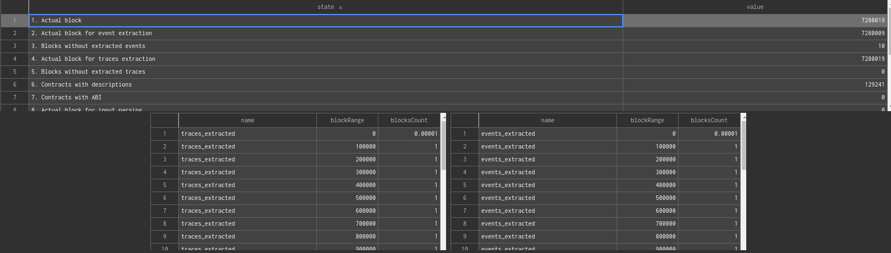
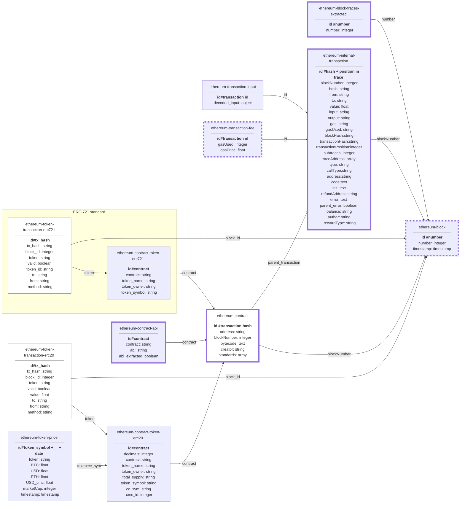
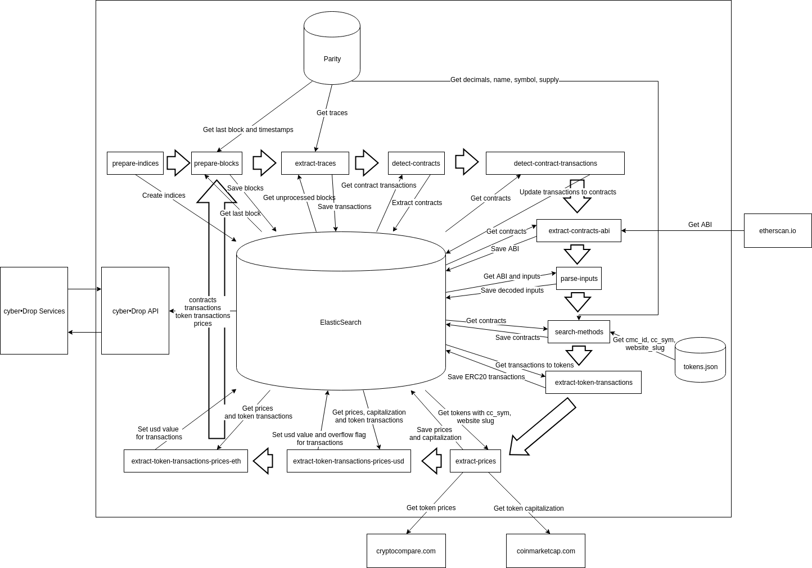

# cyber•Drop core

## Installation

### With docker-compose

To build all nessesary containers (clickhouse, parity, tabix, core), use command:
```bash
docker-compose up
```

Check the correctness of the installation using
```bash
docker-compose run core --operation test
```

Maybe, you'll have to wait a bit while parity will get an actual info from Ethereum chain

### With vanilla docker

To build docker container, use command

```bash
docker build -t cyberdrop/core .
```

To install parity, use:

```bash
docker pull parity/parity:stable
docker run -p 8545:8545 parity/parity:stable --jsonrpc-interface=all --tracing=on
```

To install clickhouse, use:

```bash
docker pull yandex/clickhouse-server:18.12.17
docker run yandex/clickhouse-server:18.12.17 -p 9000:9000 -p 8123:8123 
```

You can see actual options for these containers in docker-compose.yml file

Make sure you've activated clickhouse and parity ports. 

```bash
$ curl localhost:8545
Used HTTP Method is not allowed. POST or OPTIONS is required

$ curl localhost:9000
Port 9000 is for clickhouse-client program.
You must use port 8123 for HTTP.
```

Check the correctness of the installation using

```bash
docker run --network host cyberdrop/core --operation test
```

### Configuration

Configuration is located in config.py file. Please check this list before installation:
- INDICES - Dictionary of table names in Clickhouse. Meaning of each table explained below
- PARITY_HOSTS - URLs of parity APIs. You can specify block range for each URL to use different nodes for each request
- NUMBER_OF_JOBS - Size of pages received from Clickhouse
- EVENTS_RANGE_SIZE - Number of blocks processed simultaneously during events extraction
- INPUT_PARSING_PROCESSES - Number of chunks processed simultaneously during input parsing
- PROCESSED_CONTRACTS - List of contract addresses to process in several operations. All other contracts will be skipped during certain operations
- ETHERSCAN_API_KEY - API key for etherscan.io ABI extraction
- ETHEREUM_START_DATE - The date of zero block in target chain

## Usage

### Real-time synchronization

To start real-time synchronization loop, use:
```bash
# With vanilla docker
docker run --network host cyberdrop/core --operation start

# With docker-compose
docker-compose run core --operation start
```

To start synchronization with additional info for contracts whitelisted in config.py (extract ABI, parse inputs), use:
```bash
# With vanilla docker
docker run --network host cyberdrop/core --operation start-full

# With docker-compose
docker-compose run core --operation start-full
```

### Stats

Docker bundle contains tabix dashboard named "ETH SQL" that shows status of synchronization. You can look at the state of database [here](http://localhost:8080).



This query checks the actual state over all blocks, unsynchronized blocks and contracts.

### Examples

Usage examples of the crawlers are located in **examples** dir of this repo. The actual description of examples goes below:
- [gas_price_estimation.ipynb](https://gitlab.com/cyberdrop/core/blob/docker_compose/examples/gas_price_estimation.ipynb)

Estimation of gas price for transactions between wallets

### Schema

Current data schema is going below:



### Architecture

All components of this repo and their interactions can be found below:

```
TODO Will be updated
```



### Operations
```
TODO add syntax from command line run with --help arg
```

Operation type can be selected from list below:

- prepare-indices (indices.py)

Prepare tables in Clickhouse database

- prepare-blocks (blocks.py)

Extract blocks with timestamps to Clickhouse

- extract-traces (internal_transactions.py)

Starts extraction of internal ethereum transactions

- extract-events (events.py)

Starts extraction of ethereum events

- prepare-contracts-view (contract_transactions.py)

Prepare material view with contracts extracted from transactions table

- extract-contracts-abi (contracts.py)

Extract ABI description from etherscan.io for contracts specified in config

- parse-transactions-inputs, parse-events-inputs (contracts.py)

Starts input parsing for transaction or event. 
There will be created a table with names of called methods and arguments description.
Works only for contracts specified in config

- prepare-erc20-transactions-view (token_holders.py)

Prepare material view with erc20 transactions extracted from transactions table.

- search-methods (contract_methods.py)

Checks if contracts contain signatures of standards-specific methods. The list of standards stored in 'standards' field.
It also saves ERC20 token names, symbols, total supply and etc.

- extract-prices (token_prices.py)

Download token capitalization, ETH, BTC and USD prices from cryptocompare and coinmarketcap