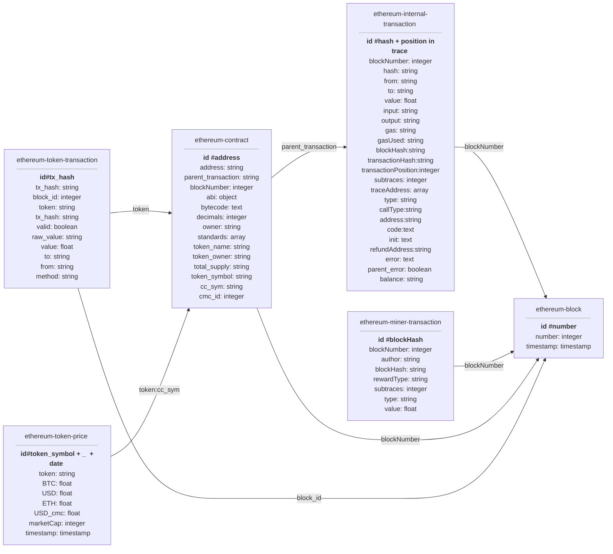

# cyber•Drop core

## Installation

To build contents of this repo, use command:

```bash
./install.sh
```

Make sure you are done with everything correctly:
```bash
nosetests .
```

## Configuration

Configuration is located in config.py file. Please check this list before installation:
- INDICES - Dictionary of index names in ElasticSearch
- PARITY_HOSTS - URLs of parity APIs. You can specify block range for each URL to use different nodes for each request
- NUMBER_OF_JOBS - Size of pages received from ElasticSearch
- PROCESSED_CONTRACTS - List of contract addresses to process in several operations. All other contracts will be skipped

## Usage

### History synchronization process
To start synchronization process at first time without starting point dump, use:

```bash
python3 ./extractor.py --operation prepare-indices
python3 ./extractor.py --operation prepare-blocks
python3 ./extractor.py --operation extract-traces
python3 ./extractor.py --operation detect-contracts
python3 ./extractor.py --operation detect-contract-transactions
python3 ./extractor.py --operation extract-contracts-abi
python3 ./extractor.py --operation search-methods
python3 ./extractor.py --operation extract-prices
python3 ./extractor.py --operation parse-inputs
python3 ./extractor.py --operation extract-token-transactions
python3 ./extractor.py --operation extract-token-transactions-prices-usd
python3 ./extractor.py --operation extract-token-transactions-prices-eth
```

### Dump installation
To start from existed database dump, use:
```bash
TODO
```

### Real-time synchronization
To start real-time synchronization loop, use:

```bash
python3 ./extractor.py --operation run-loop
```

### Operations
Operation type can be selected from list below:

- prepare-indices

Prepare indices in ElasticSearch

- prepare-blocks (blocks.py)

Extract blocks with timestamps to ElasticSearch


- extract-traces (internal_transactions.py)

Starts extraction of internal ethereum transactions

- detect-contracts (contract_transactions.py)

Extract contract info (address, bytecode, author, etc) from transactions


- detect-contract-transactions (contract_transactions.py)

Highlight all transactions to contracts with to_contract flag


- extract-contracts-abi (contracts.py)

Extract ABI description from etherscan.io for specified contracts


- parse-inputs (contracts.py)

Starts input parsing. Each transaction will get a field 'decoded_input' with name of method and arguments description


- search-methods (contract_methods.py)

Checks if contracts contain signatures of standards-specific methods. The list of standards stored in 'standards' field.
It also saves ERC20 token names, symbols, total supply and etc.


- extract-token-transactions (token_holders.py)

Downloads list of tokens from coinmarketcap API and tries to find contracts with corresponding names in ES and then saves matching contracts into separate index. After finishing this process finds all transactions that have 'to' field equal to token contract address and also saves these transaction to separate index.


- extract-prices (token_prices.py)

Download token capitalization, ETH, BTC and USD prices from cryptocompare and coinmarketcap

- extract-token-transactions-prices-* (token_transactions_prices.py)

Set USD and ETH prices for transactions. Also set an "overflow" field - a probability that transaction value is corrupted,
i.e. is greater than market capitalization

- run-loop

Runs real-time synchronization loop


### Indices

Current data schema is going below:



### Architecture

All components of this repo and their interactions can be found below: